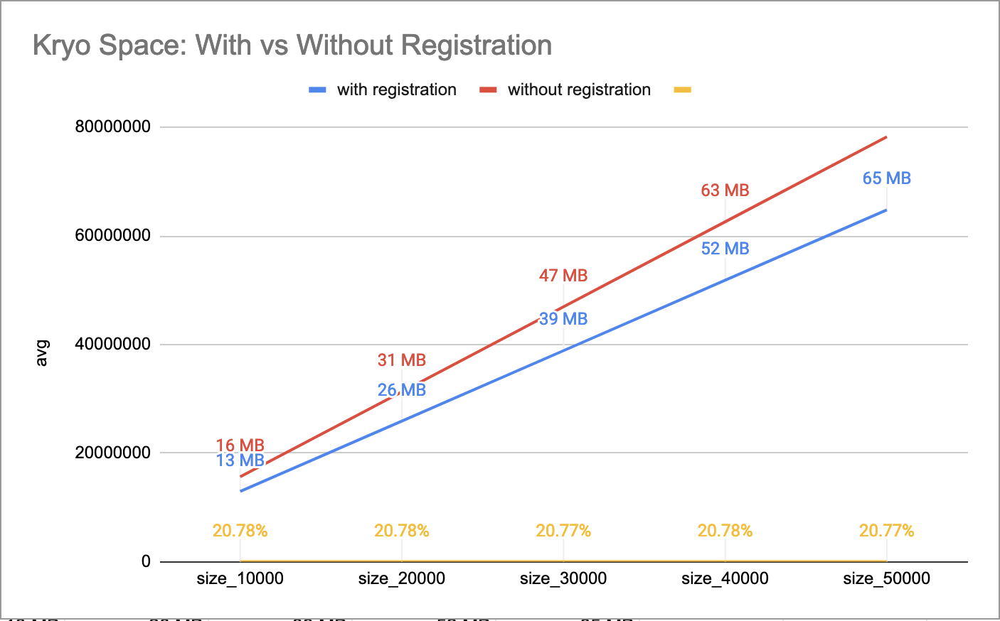

= Pitfalls in Kryo Serialization
nMoncho
2022-01-03
:title: Pitfalls in Kryo Serialization
:imagesdir: ./
:tags: [scala,java,serialization,benchmark]

For one of our projects we serialize information coming from IoT devices into a Kafka topic, which
is later processed by several application that aggregate the information for different use cases
(e.g. notify user when room temperature has drop below a threshold). In the Java ecosystem we have
several tools to perform this serialization: https://thrift.apache.org/[Apache Thrift],
https://avro.apache.org/[Apache Avro], or https://developers.google.com/protocol-buffers[Google Protocol Buffers]
to name a few. In this project, though, we decided to use https://github.com/EsotericSoftware/kryo[Kryo],
which offers another set of tradeoffs than the aforementioned libraries. Along the years we ran into several
pitfalls, my hope is that with this blogpost you can avoid making the same mistakes.

You can check the companion code to this blogpost https://github.com/nMoncho/kryo-pitfalls[here].

== Introduction

According to Kryo's GitHub page:

____
Kryo is a fast and efficient binary object graph serialization framework for Java. The goals of the
project are high speed, low size, and an easy to use API. The project is useful any time objects need
to be persisted, whether to a file, database, or over the network.

Kryo can also perform automatic deep and shallow copying/cloning. This is direct copying from object to
object, not object to bytes to object.
____

This means that Kryo's use case is, just like other serialization libraries, sharing data between parties
(i.e. between a writer and a reader). An important difference with other libraries is that we don't have
to define a schema before we can start sending data (e.g. with Avro, we use
https://avro.apache.org/docs/current/idl.html[Avro IDL]), and this can be a source of problems if it's not
handled carefully.

=== Registration

While working with Kryo, we can _optionally_ register the classes that we want to serialize:

[source,scala]
----
case class Person(id: Long, name: String, age: Int)
val alice = Person(1L, "Alice", 42)

val kryo = new Kryo()
kryo.register(classOf[Person])

// Write
val output = new Output(new FileOutputStream("file.bin"))
kryo.writeObject(output, alice)
output.close()

// Read
val input = new Input(new FileInputStream("file.bin"))
val aliceFromFile = kryo.readObject(input, classOf[Person])
input.close()
----

*Note*: to make the previous snippet work, you have to add a _no-args_ constructor to `Person`. I decided
to omit it for brevity, but it's required for every class that you serialize with Kryo.

As mentioned, class registration is optional, but required by default, which can be disabled with
`kryo.setRegistrationRequired(false)`.

If we analyze the output from both procedures we find them identical:

[source,shell]
----
❯ xxd object-with-registration.bin
00000000: 0154 0201 416c 6963 e5                   .T..Alic.

❯ xxd object-without-registration.bin
00000000: 0154 0201 416c 6963 e5                   .T..Alic.
----

== Pitfall #1: Compatibility

Initially one could be led to believe that there is no difference between registering and not registering
a class, but let's take a look at the next snippet:

[source,scala]
----
case class Message(wholePayload: String, size: Int, ts: Long)  // <- New Message class
case class Person(id: Long, name: String, age: Int)
val alice = Person(1L, "Alice", 42)

val kryo = new Kryo()
kryo.register(classOf[Person])
kryo.register(classOf[Message])

val output = new Output(new FileOutputStream("file.bin"))
kryo.writeObject(output, alice)                                // <--- Write a Person
output.close()

val input = new Input(new FileInputStream("file.bin"))
val messageFromFile = kryo.readObject(input, classOf[Message]) // <--- Read a Message
input.close()
----

This is perfectly valid, even if `Message` and `Person` are completely different, they have different field
names. The only similarity is that both classes have three fields with the same types, just with a different
order.
The reason why this works has to do with how `FieldSerializer` (the default serializer for objects) is
implemented:

____
FieldSerializer is efficient by writing only the field data, without any schema information, using the
Java class files as the schema. It does not support adding, removing, or changing the type of fields
without invalidating previously serialized bytes. Renaming fields is allowed only if it doesn't change
the alphabetical order of the fields.
____

Since both classes' fields, once sorted by name, define the same order:
`age, id, name` `==` `size, timestamp, wholePayload`,  Kryo deserializes a class' data into another class.
We can solve this issue if we replace both write and read methods with ones that include the classes inside
the payload:

[source,scala]
----
case class Message(wholePayload: String, size: Int, ts: Long)
case class Person(id: Long, name: String, age: Int)
val alice = Person(1L, "Alice", 42)

val kryo = new Kryo()
kryo.register(classOf[Person])
kryo.register(classOf[Message])

val output = new Output(new FileOutputStream("file.bin"))
kryo.writeClassAndObject(output, alice)
output.close()

val input = new Input(new FileInputStream("file.bin"))
val personFromFile = kryo.readClassAndObject(input)
input.close()
----

Notice that we no longer have to specify the `class` while reading. Thus we're effectively trading schema
enforcement from _read_ time to _write_ time. Which coming full circle, if we attempt to do the same thing
but without registering both classes, we get different outputs:

[source,shell]
----
❯ xxd class-and-object-with-registration.bin
00000000: 0c01 5402 0141 6c69 63e5                 ..T..Alic.

❯ xxd class-and-object-without-registration.bin
00000000: 0100 6578 616d 706c 652e 4261 7369 634b  ..example.BasicK
00000010: 7279 6f55 7361 6765 5370 6563 2450 6572  ryoUsageSpec$Per
00000020: 736f ee01 5402 0141 6c69 63e5            so..T..Alic.
----

The first serialization with registration includes the class identifier: `0c`. The rest of the payload is the
same as the ones produced by the previous example. The second serialization uses the class' fully qualified
name, which not only uses more space, but it's also less performant. You can run `RegistrationBenchmark` to
compare the performance of both types, according to my numbers both speed and space increase between _10%_
and _20%_.

.Serializing 50k Messages
|=====================================================================
|                         |With Registration |Without Registration
|With Class in Payload    | 657.663051 ms    | 767.096071 ms
|Without Class in Payload | 600.054279 ms    | 763.372908 ms
|=====================================================================

.Speed Comparison

.Space Comparison

_Figure 1_ and _Figure 2_ show a benchmark of the first row's scenario, with and without registration with
class in playlod, for different sizes. First run serialized 10k objects, second run 20k, and so on.
This benchmark uses a similar class model from our IoT devices, defining a `Message` containing a list of `Signal`.

Finally, https://github.com/twitter/chill[Twitter Chill] provides this fair warning:

____
Serialization compatibility is NOT guaranteed between releases, and for this reason, we don't recommend
using it for long-term storage. Serialization is highly dependent on scala version compatibility and on
the underlying Kryo serializers, which take different approaches to compatibility.
____

**Conclusion:** Registering classes makes Kryo more rigid, but it's also faster, which, if we combine with
including the class in the payload, we avoid headaches at read time. If our desire to keep this reading safety
but be more flexible, we end up in the worst speed/space quadrant. This is not to say that it's useless, just
that you have to consider your use case carefully, as sometimes some speed/space penalty can be paid.

Kryo also offers, like other serialization libraries, Backwards and Forwards compatibility, just not by
default, and we have to put extra thought into another tradeoff. _There is no free lunch_.

== Pitfall #2: Composition

While serializing, both writer and reader must agree on the schema before they can start interacting.
Different libraries handle this differently, you can read about this on
https://martin.kleppmann.com/2012/12/05/schema-evolution-in-avro-protocol-buffers-thrift.html[Martin Kleppmann's blogpost].
On Kryo, the way this agreement is done is that both writer and schema must agree on the identifiers (e.g.
the `0c` ID from the previous section) they use for each of the classes involved (unless registration is
turned off and the class name is serialized inside the payload), which could also lead to problems.

Imagine we have tree components: a Device, a Processor, and a Consumer. Each send information to the next
using Kryo (let's ignore the medium for now).

----
+----------------+      +----------------+      +----------------+
|     Device     |----->|    Processor   |----->|    Consumer    |
+----------------+      +----------------+      +----------------+
----

And that the _Device_ declares the classes from the previous section: `Message`, `Signal`, etc. These are then
aggregated by the _Processor_ which defines its own classes: `Event` and `Notification`. Which are then consumed
by the _Consumer_ (this latter component doesn't care about the first set of types).

When registering classes, we cannot reuse IDs, otherwise we'd run into conflict or disagreement. For example,
imagine that both the _Device_ and the _Processor_ uses ID 10 for `Message` and that the _Processor_ use ID 11 for `Event`.
But after a few months of running in production, the _Device_ decides to use ID 11, which breaks the _Processor_'s
operation.

This, together with the performance requirement of using https://github.com/EsotericSoftware/kryo#pooling[Pooling],
led _us_ to try to stuff all registration inside a single pool, for which we created another common component
to hold and register every definition, in hopes to avoid this problem. If every class registration is in a
single place, there is no way writers and readers can disagree on the ID of a class.

----
+----------------+      +----------------+      +----------------+
|     Device     |----->|    Processor   |----->|    Consumer    |
+-------+--------+      +-------+--------+      +-------+--------+
        |                       |                       |
        |                       | (uses)                |
        |                       |                       |
        |               +----------------+              |
        |    (uses)     |    Models &    |    (uses)    |
        +-------------->|  Serialization |<-------------+
                        +----------------+
----

Now the problem is that once the number of classes starts to grow this becomes harder to manage. Every change
in any given class requires an update this common library, even if the downstream component doesn't use or
care about the change.

**Conclusion:** How do we solve this issue? We've been bouncing ideas for several months, none of which entirely satisfied us.
Eventually I realised that this is a design problem, not an implementation one. We don't need to stuff
everything into a single common component, as the boundaries between systems is _now_ clearly defined. A
better solution would be for each component to expose both its models and serialization pool, since it's
the component writing to the medium the one that knows which classes effectively end up there.

----
+----------------+          +----------------+         +----------------+
|     Device     |--------->|    Processor   |-------->|    Consumer    |
+-+--------------+-+        +-+--+-----------+----+    +---------+------+
  |    Models &    |  (uses)  |  |  Models &      |      (uses)  |
  |  Serialization |<---------+  |  Serialization |<-------------+
  +----------------+             +----------------+

----

== Pitfall #3: Persistence

Right off the bat we've contradictory information, on the one hand we're told: "The project is useful any
time objects need  to be persisted, whether to a file, database, or over the network". But on the other
we're told: "Serialization compatibility is NOT guaranteed between releases, and for this reason, we
don't recommend using it for long-term storage". Writing to a file or a database may be long-term, and if
we consider the aforementioned pitfalls, it seems we should lean on the latter rather than the former.

On Pitfall #2, I mentioned that the medium wasn't relevant to the discussion, but now consider we ignore
everything we mentioned in the previous section, and we serialize information into a Kafka topic. If at any
moment the writer decides to switch registered IDs, we'll end up with a Kafka topic where some part of the
topic is with one set of IDs and another part with another set. Which means consumers can only consume one
part of the topic.

This problem forces us to this serialization problem ourselves, to which regretfully I cannot offer a suitable
solution :(

A potential solution could involve just waiting until downstream components have been updated to the new
registration IDs, but requires explicit knowledge of the change. If these components are developed and
monitored by different teams, the latter could panic while noticing messages aren't processed.

== Final Thoughts
Kryo proved to be the right choice for our project, it allowed us to move a lot of data through different
components _fast, really fast_. However, there was certainly a learning curve to it. Whenever we ran into
one of these pitfalls, we'd to go back to the whiteboard to try device solutions and potential tradeoffs.
This is to say, choosing tools is hard, you have to have an informed opinion on the different options, while
juggling between requirements, and pros and cons.

I would like to thank my colleagues https://twitter.com/ckipp01[@ckipp] and https://twitter.com/BruleVincent[@BruleVincent]
for providing feedback to this blogpost.
